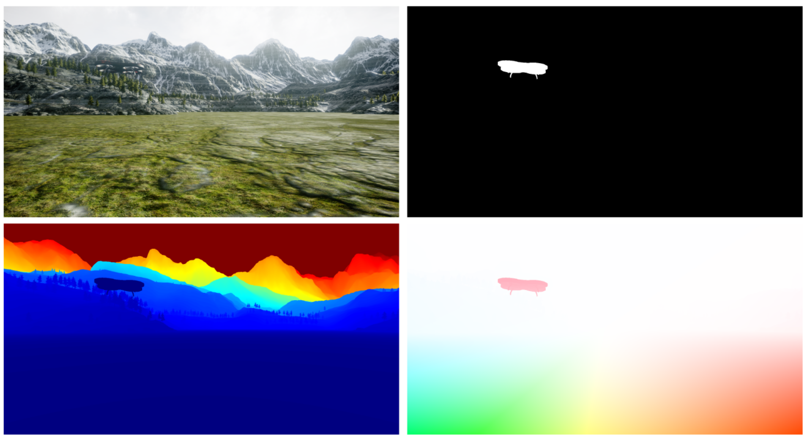

# optical-flow-mav-detection



This project is intended to run on Ubuntu 20.04, with Python 3.8.

## Install
Install the Python dependencies:

```bash
python3 -m pip install -r requirements.txt
```

Set the settings for AirSim:

```bash
cp etc/settings.json ~/Documents/AirSim/settings.json
```

The following environment variables need to be set in `.bashrc` with their correct paths:
```bash
export FLOWNET2="~/flownet2-pytorch"
export FLOWNET2_CHECKPOINTS_DIR="~/tno/datasets/flownet2-checkpoints"
```

Optionally, you can set the following environment variables depending on which dataset you want to use:
```bash
export SIMDATA_PATH="~/tno/datasets/sim-data"
export YOLOv4_PATH="~/tno/yolov4"
export MIDGARD_PATH="~/tno/datasets/MIDGARD"
export UNDISTORT_PATH="~/tno/datasets/undistortFunctions/launch_docker.sh"
```

## Usage
To see all possible command arguments:

```bash
python3 src/main.py --help
```

Which outputs:
```
usage: main.py [-h] [--dataset DATASET] [--sequence SEQUENCE] [--mode MODE] [--algorithm ALGORITHM] [--debug] [--prepare-dataset] [--validate] [--headless] [--run-all] [--data-to-yolo] [--undistort]

Detects MAVs in the dataset using optical flow.

optional arguments:
  -h, --help            show this help message and exit
  --dataset DATASET     dataset to process
  --sequence SEQUENCE   sequence to process
  --mode MODE           mode to use, see RunConfig.Mode
  --algorithm ALGORITHM
                        detection algorithm to use, see Detection.Algorithm
  --debug               whether to debug or not
  --prepare-dataset     prepares the YOLOv4 training dataset
  --validate            validate the detection results
  --headless            do not use UIs
  --run-all             run all configurations
  --data-to-yolo        convert annotations to the YOLO format
  --undistort           undistort original
```


To check the typing of the Python code run:

```bash
mypy
```

## Related projects
### [YOLOv4](https://github.com/evroon/yolov4)
[](https://github.com/evroon/yolov4/actions/workflows/main.yml)

### [flownet2-pytorch](https://github.com/evroon/flownet2-pytorch)

[](https://github.com/evroon/flownet2-pytorch/actions/workflows/main.yml)

## Other repositories created for this project

### [raft](https://github.com/evroon/RAFT)
[](https://github.com/evroon/RAFT/actions/workflows/main.yml)

### [semantic-segmentation](https://github.com/evroon/semantic-segmentation)
[](https://github.com/evroon/semantic-segmentation/actions/workflows/main.yml)


### [undistort-functions](https://github.com/evroon/undistort-functions)
[](https://github.com/evroon/undistort-functions/actions/workflows/main.yml)


### [mask-rcnn](https://github.com/evroon/mask-rcnn)
[](https://github.com/evroon/mask-rcnn/actions/workflows/main.yml)

### [docker-orb-slam2-build](https://github.com/evroon/docker-orb-slam2-build)

### [pytorch-liteflownet](https://github.com/evroon/pytorch-liteflownet)

### [MaskFlownet](https://github.com/evroon/MaskFlownet)